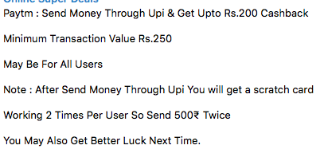
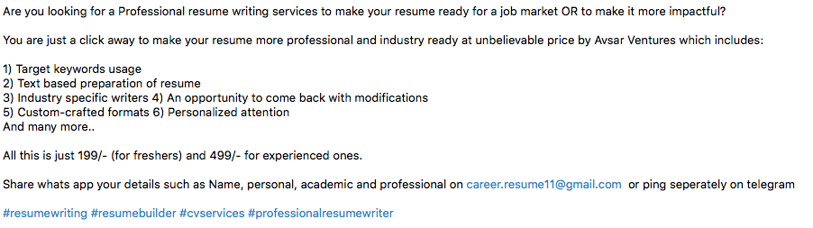

# Spam Detection using Machine Learning on WhatsApp Messages

I've Created this project to detect All kinds of spam messages on whatsapp using Machine Learning Techniques.
These spam messages are messages are are irrelevant/forwarded in large numbers that circulate between Whatsapp users.
As there is no datasets available of WhatsApp messages online (As of now) i decided to create my own. 
Ham messages are not spam and mostly conversation type.

Examples of Spam on Whatsapp:

